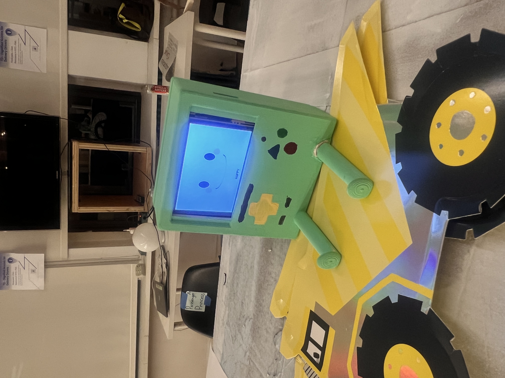

# 🚛 DriveBoy

**Your Emotional Co-Driver**

An emotionally responsive companion device that supports fatigue, loneliness, and wellbeing for long-haul truck drivers.

---

## 🎯 The Problem

Long-distance truck drivers spend **8–11+ hours alone** on the road daily. Many report:

- 🥱 **Chronic fatigue** & drowsy driving (13% of accidents are fatigue-related)
- 😔 **Emotional numbness** or loneliness
- 🤔 **Difficulty recognizing** when they need rest
- 🚫 **Lack of non-intrusive support** during long routes

> *Navigation apps guide routes — but nothing reflects back how the driver is feeling.*

**DriveBoy is not a GPS.**  
It is a **co-presence** — a small friend beside you who reacts, encourages, and gently supports you.

---

## ✨ What is DriveBoy?

DriveBoy is a **hardware companion device + mobile app** that expresses emotions, supports wellness, and nudges drivers toward rest when needed.

It uses **simple expressive faces + supportive behaviors** instead of alerts or stress-inducing notifications.


---

## 💬 Emotional Expressions

DriveBoy communicates through **feelings** — not commands.

| State | Expression | Behavior |
|-------|-----------|----------|
| 😊 **HAPPY** | `^_^` | Positive reinforcement |
| 😴 **SLEEPY** | `-*-` | Encourages rest |
| 🚨 **ALERT** | `O_O` | Strong alert moment |
| 😌 **CALM** | `- -` | Breathing + grounding |
| 😢 **LONELY** | `;-;` | Soft companionship |
| 🤗 **COMFORT** | `uwu` | Warm presence |

---

## 🚦 Two Main Modes

### 🚗 Driving Mode
**Gentle support without distraction**

- **Wellness reminders** (meal time, hydration, stretch breaks)
- **Subtle fatigue reflection** (time feedback)
- **Emotional feedback** (passive companionship)
- **GPS-based rest alerts** (nearby rest stops with parking, food, fuel)

### 🛌 Rest Mode
**When the engine stops, DriveBoy becomes playful & caring**

Interactive activities:
- 🫁 **Breathing** — Calm down exercises
- 🧘 **Stretch** — Relaxation routines
- 🎤 **Sing Together** — Mood-lifting moments
- 🎯 **Tap Game** — Quick mental engagement
- 🎨 **Color Match** — Focus and fun
- 🧠 **Memory Match** — Brain exercise

---

## 🛠️ Tech Overview

### Hardware
- **Microcontroller**: ESP32
- **Display**: TFT LCD (bigger, clearer expressions)
- **Communication**: Bluetooth Low Energy (BLE)
- **Power**: Rechargeable battery (USB-C)

### Software
- **Mobile App**: Flutter 3.x
- **State Management**: Provider / Riverpod
- **BLE Protocol**: flutter_blue_plus
- **Backend**: Firebase (optional analytics)

### Firmware
- **Platform**: Arduino / ESP-IDF
- **Language**: C++
- **Libraries**: BLEDevice, TFT_eSPI, ArduinoJson

---

## 🎨 Physical Design

DriveBoy was intentionally designed to feel:

✔️ **soft**  
✔️ **friendly**  
✔️ **approachable**  
✔️ **slightly nostalgic**

So drivers feel **companionship** — not pressure.

**Exhibition**: DriveBoy was exhibited as an interactive installation, simulating a truck cab space so visitors could experience emotional companionship firsthand.

---

## 🔬 Research Background

### User Interviews

Conducted **secondary research** and **interviews** with long-haul truck drivers:

> *"My day usually starts between 2 and 4 a.m. I drive up to 11 hours a day... After work, I usually sleep inside the truck, either in a parking lot or at a rest stop."*

> *"The best part is seeing beautiful scenery and discovering new cities — but the downside is the constant fatigue and loneliness."*

### Key Insights

Drivers often:
- 🧠 **Underestimate fatigue** during monotonous driving
- 💬 **Lack someone to communicate with** during long routes
- 🕹️ **Seek simple comfort** — not complexity

**DriveBoy was created to sit quietly beside the driver — not to overwhelm, track, or judge them.**

---

## 🎥 Demo

### Early Prototype

[](https://youtube.com/shorts/6hnh9SocZtg)

**Watch the live demo:** [YouTube Shorts](https://youtube.com/shorts/6hnh9SocZtg)

Showing:
- Real-time emotional expression changes
- BLE communication between device and Flutter app
- Mood-responsive animations

### New Prototype ✨



*Improved design with larger screen, softer appearance, and refined emotional expressions.*

---

## 📦 Repository Structure

```
driveboy_app/
├── firmware/           # ESP32 + TFT firmware
├── app/               # Flutter mobile application
├── docs/              # Documentation
│   └── DriveBoy.pdf   # Full design + research report
├── images/            # README assets
└── README.md
```

---

## 🚀 Getting Started

### Hardware Setup

1. **Flash ESP32:**
```bash
cd firmware
pio run --target upload
```

2. **Wire TFT display:**
```
ESP32 Pin  →  TFT Pin
GPIO 23    →  MOSI
GPIO 18    →  SCK
GPIO 15    →  CS
GPIO 2     →  DC
GPIO 4     →  RST
3.3V       →  VCC
GND        →  GND
```

### Mobile App Setup

1. **Clone repository:**
```bash
git clone https://github.com/Hye-Seung-Kim/driveboy_app.git
cd driveboy_app/app
```

2. **Install dependencies:**
```bash
flutter pub get
```

3. **Run the app:**
```bash
flutter run
```

---

## 🔮 Future Roadmap

- [ ] Voice-responsive emotion system
- [ ] ML-based personalization (learn driver patterns)
- [ ] Multi-device community link (connect drivers)
- [ ] Physiological input support (optional heart rate)
- [ ] Integration with truck telemetry (speed, route)
- [ ] Weather-aware behavior adjustments

---

## 📄 Documentation

📖 **Full Project Report**: [DriveBoy.pdf](docs/DriveBoy.pdf)

Includes:
- Complete research methodology
- Design iteration process
- Technical specifications
- User testing results
- Exhibition documentation

---

## 🙏 Acknowledgments

- **Truck drivers** who participated in research interviews
- **School of Visual Arts** MFA Interaction Design program
- **Physical Computing course** instructors and peers

---

## 📬 Contact

**Hyeseung (Seren) Kim**  
MFA Interaction Design — School of Visual Arts

- 🔗 Portfolio: [coming soon]
- 💼 LinkedIn: [linkedin.com/in/yourprofile]
- 📧 Email: [your.email@sva.edu]

---

<p align="center">
  Built with ❤️ for the drivers who keep the world moving.
</p>

---

## 📝 License

MIT License - see [LICENSE](LICENSE) for details

---

## 🎨 Assets Credit

All design, research, and development by Hyeseung Kim (Seren Kim).  
Project created as part of SVA MFA Interaction Design coursework.